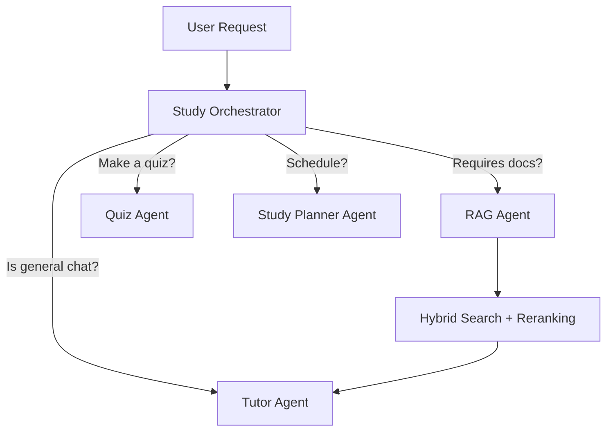

# AI Architecture

## 1. Multi-Agent Orchestration
The AI system is not a single massive prompt. It relies on a **Study Orchestrator** to route requests to specialized agents.

### Specialized Agents
1. **Tutor Agent:** The core persona. Explains concepts, adapts to user difficulty (Beginner/Intermediate/Technical).
2. **RAG Agent:** Handles document Q&A, strictly citing page numbers and avoiding hallucination.
3. **Quiz/Flashcard Agent:** Outputs structured JSON formats for tests.
4. **Safety Agent (Implicit):** Validates prompts and inputs against injection.

## 2. RAG Pipeline (Retrieval-Augmented Generation)

### Ingestion (Background Job)
1. **Extraction:** PDF text extraction (and basic OCR if required).
2. **Cleaning:** Remove headers, footers, whitespace noise.
3. **Chunking:** Semantic or fixed-size chunking with overlap (e.g., 500 tokens, 50 overlap).
4. **Embedding:** Generate vectors (e.g., `text-embedding-3-small`).
5. **Storage:** Store in PostgreSQL `DocumentChunk` with `userId` and `documentId`.

### Retrieval (Query Time)
1. **Hybrid Search:**
   - Vector Similarity (pgvector `<=>` operator).
   - Keyword Search (PostgreSQL Full Text Search `@@`).
2. **Reranking:** Re-order top 15 results to pick the best 3-5 chunks.
3. **Context Construction:** Feed the 3-5 chunks to the LLM with strict instructions to *only* use provided context.

## 3. Cost Optimization Strategies
- **Content Hashing:** Generate SHA256 of text chunks. Avoid re-embedding identical text across the system.
- **Model Routing:** 
  - Use smaller, cheaper models (e.g., GPT-4o-mini, Claude 3 Haiku, Gemini Flash) for intent classification, summarization, and formatting.
  - Use premium models (e.g., GPT-4o, Claude 3.5 Sonnet) only for complex reasoning and "Deep Think" mode.
- **Top-K Limits:** Cap retrieval to prevent massive token context windows.
- **Memory Compression:** Summarize long chat histories instead of sending the entire transcript.

## 4. Hallucination Control
- The prompt explicitly mandates: *"If the answer is not in the provided documents, state: 'I couldn't find enough information in your uploaded material to answer this confidently.'"*
- Requires mandatory citations referencing the `pageNumber` from the chunk metadata.

## 5. Security
- **Tenant Isolation:** Vector searches are ALWAYS pre-filtered by `userId`.
- **Prompt Injection:** System prompts are isolated from user inputs, and input validation limits query length.
