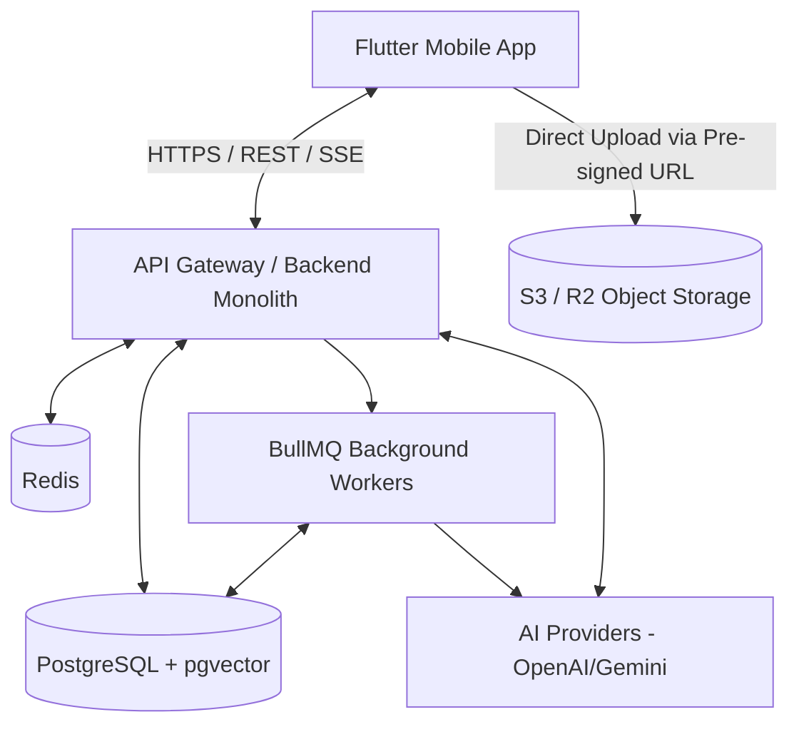

# Project Architecture

## Overview
AI Study Companion follows a **Modular Monolith** architecture for the backend and a **Feature-Driven** architecture for the Flutter mobile application. This approach minimizes operational complexity while maintaining clear boundaries, allowing a seamless transition to microservices if scale demands it in the future.

## 1. System Architecture



## 2. Backend Architecture (Node.js + TypeScript + NestJS/Express)
The backend is structured into distinct, self-contained modules.

### Modules:
- **Auth Module:** JWT generation, refresh token rotation, login/registration.
- **User Module:** Profiles, settings, subscriptions.
- **Document Module:** Pre-signed URLs, document metadata, processing status.
- **RAG Module:** Embeddings, vector search, chunking.
- **AI Tutor Module:** Orchestrator, chat history, prompt generation.
- **Quiz / Flashcard Modules:** Question generation, spaced repetition logic.
- **Study Plan / Analytics Modules:** Goal tracking, progress aggregation.
- **Notification Module:** Push notifications (FCM/APNs).

### Background Workers (BullMQ)
Heavy tasks are offloaded to Redis-backed queues:
- `document-processing`: Text extraction, chunking, embedding generation.
- `analytics-aggregation`: Periodic crunching of study stats.
- `notification-delivery`: Scheduling and sending study reminders.

## 3. Mobile Architecture (Flutter)
The Flutter application uses a feature-based folder structure with **Riverpod** for state management and **GoRouter** for navigation.

### Folder Structure
```text
lib/
├── core/
│   ├── network/       # Dio interceptors, error mapping
│   ├── storage/       # SQLite/Drift, secure storage
│   ├── theme/         # Design system tokens
│   ├── routing/       # GoRouter configuration
│   └── errors/        # Global exception handling
├── features/
│   ├── auth/          # Login, Register
│   ├── dashboard/     # Home screen, study streak, AI tip
│   ├── chat/          # AI Tutor UI, streaming messages
│   ├── documents/     # PDF upload, document list
│   ├── study_plan/    # Study sessions, focus timer
│   └── ...
└── main.dart
```

## 4. Key Architectural Decisions
1. **Modular Monolith over Microservices:** Reduces infrastructure overhead, simplifies deployment, and keeps transactions straightforward until scaling bottlenecks appear.
2. **PostgreSQL + pgvector:** Avoids the operational cost and complexity of maintaining a separate vector database. It supports ACID compliance alongside embeddings.
3. **Pre-signed S3 URLs:** Offloads file upload bandwidth from the Node.js backend directly to the storage provider.
4. **Offline-First Capabilities (Flutter):** Essential features like the Focus Timer and Study Plans use SQLite locally and sync to the server when online.
